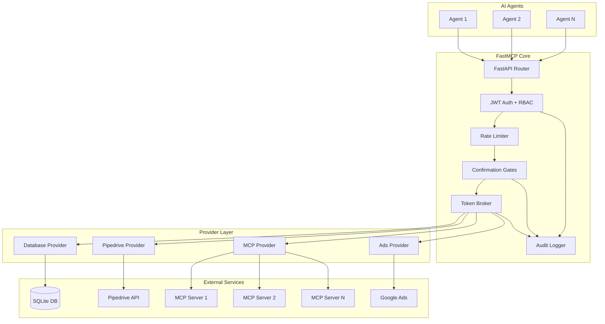
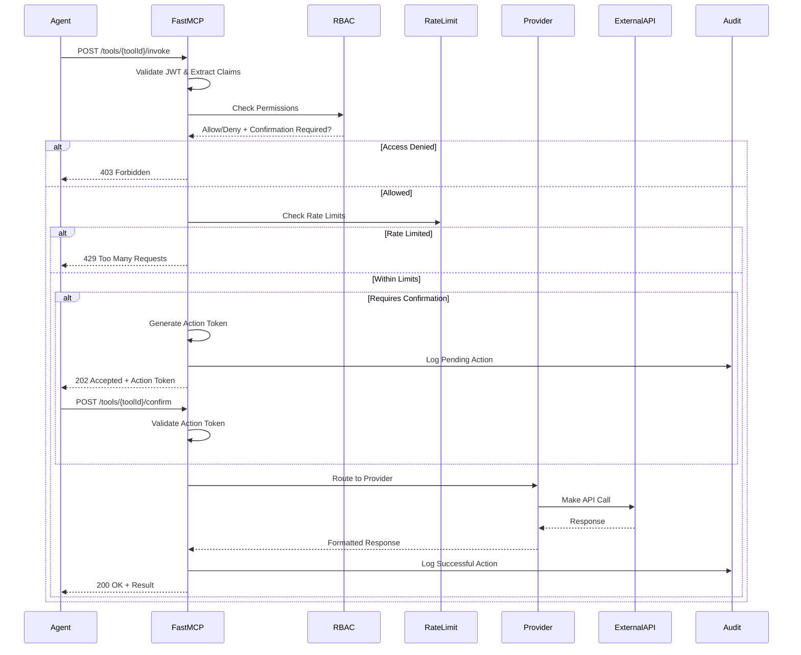
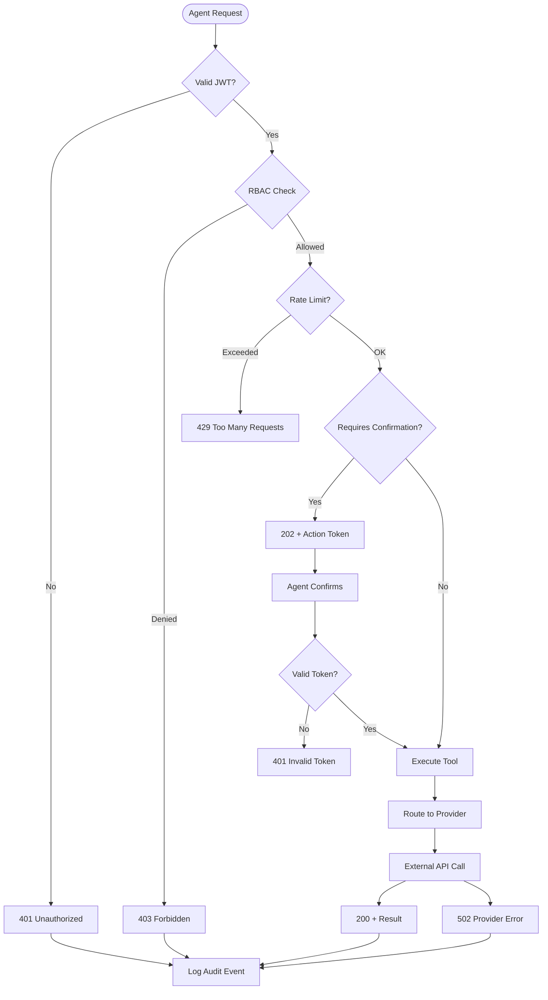

# FastMCP - Enterprise AI Agent Tool Orchestration Platform

FastMCP is a production-ready orchestration platform for enterprise AI agent tooling. It provides secure, scalable, and auditable access to external tools and services through a unified API with enterprise-grade security, RBAC/ABAC enforcement, confirmation gates, token brokering, rate limiting, and immutable audit trails..

## 🏗️ Architecture Overview



## 🔄 Request Flow Diagram



## 📁 Codebase Structure

```
fastmcp/
├── api/                    # FastAPI routes and dependencies
│   ├── deps.py            # JWT validation, session management
│   ├── routes_catalog.py  # Tool catalog endpoints
│   ├── routes_internal.py # Health checks, metrics
│   ├── routes_manifests.py# Tool manifest registration
│   ├── routes_tools.py    # Tool invocation and confirmation
│   └── utils.py           # Request hashing, error responses
├── core/                  # Core business logic
│   ├── config.py          # Environment configuration
│   ├── rate_limit.py      # Token bucket rate limiting
│   ├── rbac.py            # Role-based access control
│   ├── security.py        # JWT handling, correlation IDs
│   └── token_broker.py    # Provider token exchange
├── db/                    # Database layer
│   ├── schemas_sqlmodel.py# SQLModel schemas
│   └── session.py         # Database session management
├── models/                # Pydantic models
│   ├── audit.py           # Audit event models
│   ├── tool_manifest.py   # Tool definition schemas
│   └── user_agent.py      # User agent parsing
├── providers/             # External service integrations
│   ├── base.py            # Provider interface
│   ├── ads_provider.py    # Google Ads integration
│   ├── database_provider.py# SQLite database access
│   ├── mcp_provider.py    # MCP server integration
│   └── pipedrive_provider.py# Pipedrive CRM integration
├── policies/              # RBAC policy definitions
│   └── policies.yml       # Role and rule definitions
├── tests/                 # Test suite
│   ├── conftest.py        # Test fixtures
│   ├── test_happy_path.py # End-to-end success flows
│   ├── test_policy_denial.py# RBAC failure scenarios
│   ├── test_confirmation_flow.py# Confirmation workflows
│   └── test_idempotency.py# Idempotency key handling
├── utils/                 # Utilities
│   ├── audit_logger.py    # Immutable audit logging
│   └── openapi_ingestor.py# OpenAPI spec processing
├── main.py                # FastAPI application entry point
└── pyproject.toml         # Project dependencies
```

## 🔐 Security Architecture

### JWT Authentication Flow
```mermaid
graph LR
    subgraph "Token Validation"
        JWT[JWT Token] --> VERIFY[Verify Signature]
        VERIFY --> CLAIMS[Extract Claims]
        CLAIMS --> VALIDATE[Validate Expiry]
    end
    
    subgraph "Claims Structure"
        SUB[Subject: agent-id]
        TENANT[Tenant: organization]
        ROLES[Roles: [finance-write]]
        SCOPES[Scopes: [ads.write]]
    end
    
    VALIDATE --> SUB
    VALIDATE --> TENANT
    VALIDATE --> ROLES
    VALIDATE --> SCOPES
```

### RBAC Policy Engine
```yaml
# policies/policies.yml
roles:
  agent: ["tools.invoke:read", "tools.query:catalog"]
  finance-write: ["ads.write", "tools.invoke:write"]
  sales-write: ["pipedrive.write", "tools.invoke:write"]
  data-analyst: ["database.read", "database.execute", "tools.invoke:write"]
  data-admin: ["database.read", "database.execute", "database.write", "tools.invoke:write"]
  mcp-user: ["mcp.filesystem", "mcp.database", "mcp.git", "tools.invoke:write"]
  mcp-admin: ["mcp.*", "tools.invoke:write"]

rules:
  - id: invoke-ads-create
    effect: allow
    when:
      action: tools.invoke
      resource.toolId: "ads:createCampaign"
      subject.roles: ["finance-write"]
    require_confirmation: true
```

## 🛠️ Provider System

### Provider Interface
All providers implement the `ProviderAdapter` base class:

```python
class ProviderAdapter:
    def __init__(self, provider_id: str):
        self.provider_id = provider_id
    
    async def exchange(self, scopes: list[str], subject: str, tenant: str, purpose: str) -> dict:
        """Exchange FastMCP token for provider-specific credentials"""
        pass
    
    async def call(self, endpoint: str, payload: dict) -> dict:
        """Execute tool call on external service"""
        pass
```

### Available Providers

#### 1. Database Provider (`database_provider.py`)
- **Purpose**: Secure SQL query execution
- **Tools**: `listTables`, `getSchema`, `executeQuery`
- **Security**: Query validation, parameterized execution, row limits
- **Async**: Uses `asyncio.to_thread` for non-blocking SQLite access

#### 2. Pipedrive Provider (`pipedrive_provider.py`)
- **Purpose**: CRM operations
- **Tools**: `createDeal`, `getDeal`, `updateDeal`, `createContact`
- **Auth**: API token-based authentication
- **Configuration**: `PIPEDRIVE_API_TOKEN`, `PIPEDRIVE_COMPANY_DOMAIN`

#### 3. MCP Provider (`mcp_provider.py`)
- **Purpose**: Integration with Model Context Protocol servers
- **Features**: Auto-discovery, retry with backoff, dynamic tool registration
- **Configuration**: Environment variables `MCP_*_URL`
- **Scalability**: Add new MCP servers by adding environment variables

#### 4. Ads Provider (`ads_provider.py`)
- **Purpose**: Google Ads campaign management
- **Tools**: `createCampaign`
- **Security**: Requires confirmation for financial operations

## 🚀 How to Add Components

### Adding a New Agent

1. **Generate JWT Token** with appropriate roles and scopes:
```python
import time
from jose import jwt
from fastmcp.core.config import get_dev_crypto_material

_, private_key = get_dev_crypto_material()
now = int(time.time())

payload = {
    "iss": "https://idp.local",
    "aud": "fastmcp",
    "sub": "my-agent-id",
    "tenant": "my-organization",
    "roles": ["data-analyst", "mcp-user"],  # Define agent capabilities
    "scopes": ["database.read", "mcp.filesystem", "tools.invoke:write"],
    "iat": now,
    "exp": now + 3600
}

token = jwt.encode(payload, private_key, algorithm="RS256", headers={"kid": "dev-key"})
```

2. **Use token in requests**:
```bash
curl -H "Authorization: Bearer $TOKEN" http://localhost:8001/tool-catalog
```

### Defining Agent Scopes

Edit `fastmcp/policies/policies.yml`:

```yaml
roles:
  my-custom-role: ["custom.scope", "tools.invoke:write"]

rules:
  - id: custom-tool-access
    effect: allow
    when:
      action: tools.invoke
      resource.provider_id: "my-provider"
      subject.roles: ["my-custom-role"]
```

### Adding a New Tool

1. **Create Provider** (if needed):
```python
# fastmcp/providers/my_provider.py
from .base import ProviderAdapter, register_adapter

class MyProviderAdapter(ProviderAdapter):
    def __init__(self):
        super().__init__("my-provider")
    
    async def exchange(self, scopes, subject, tenant, purpose):
        return {"access_token": "my-token", "token_type": "Bearer"}
    
    async def call(self, endpoint: str, payload: dict) -> dict:
        if endpoint == "myTool":
            return await self.my_tool(payload)
        raise ValueError(f"Unknown endpoint: {endpoint}")
    
    async def my_tool(self, payload):
        # Implement tool logic
        return {"result": "success"}

register_adapter(MyProviderAdapter())
```

2. **Register Provider** in `main.py`:
```python
from fastmcp.providers import my_provider  # noqa: F401
```

3. **Create Tool Manifest**:
```python
MY_TOOL_MANIFEST = {
    "toolId": "my-provider:myTool",
    "name": "My Custom Tool",
    "description": "Does something useful",
    "inputs": {
        "type": "object",
        "properties": {
            "param1": {"type": "string", "description": "First parameter"}
        },
        "required": ["param1"]
    },
    "outputs": {"type": "object"},
    "required_scopes": ["my-provider.use"],
    "provider_id": "my-provider",
    "tenant": "public"
}
```

4. **Add to startup seeding** in `main.py`:
```python
def seed_database():
    # ... existing code ...
    
    my_manifest = ToolManifest(**MY_TOOL_MANIFEST)
    with Session(engine) as session:
        existing = session.get(Manifest, my_manifest.toolId)
        if not existing:
            session.add(Manifest(
                toolId=my_manifest.toolId,
                manifest=my_manifest.model_dump(),
                tenant=my_manifest.tenant,
                provider_id=my_manifest.provider_id,
            ))
        session.commit()
```

### Adding a New MCP Server

1. **Start your MCP server** on a port (e.g., 3004)

2. **Add to environment** (`.env`):
```bash
MCP_MYSERVER_URL=http://localhost:3004
```

3. **Restart FastMCP** - tools are auto-discovered!

4. **Verify discovery**:
```bash
python test_mcp.py
```

The MCP provider will automatically:
- Discover tools via JSON-RPC `tools/list`
- Generate FastMCP manifests
- Register tools in the database
- Route calls to the MCP server

## 🔄 Workflows and Fallbacks

### Tool Invocation Workflow



### Fallback Mechanisms

#### 1. Provider Failures
- **Timeout handling**: 30-second timeout on external calls
- **Error wrapping**: Provider exceptions become 502 responses
- **Audit logging**: All failures are logged with correlation IDs

#### 2. Database Failures
- **Connection retry**: SQLite auto-reconnects on connection loss
- **Transaction rollback**: Failed operations don't corrupt state
- **Graceful degradation**: Service continues without audit if DB fails

#### 3. MCP Server Discovery
- **Retry with backoff**: 3 attempts with exponential backoff (500ms, 1s, 2s)
- **Non-fatal failures**: Startup continues if MCP servers are down
- **Partial discovery**: Available servers are registered, unavailable ones are skipped

#### 4. Rate Limiting
- **Memory fallback**: If Redis is unavailable, uses in-memory buckets
- **Graceful degradation**: Rate limiting disabled if both fail
- **Per-tenant isolation**: Failures in one tenant don't affect others

#### 5. JWT Validation
- **Key rotation**: Supports multiple keys in JWKS
- **Clock skew tolerance**: 5-minute tolerance for exp/iat claims
- **Graceful errors**: Invalid tokens return 401, not 500

## 🧪 Testing

### Running Tests
```bash
# Install test dependencies
pip install pytest anyio

# Run test suite
PYTHONPATH=. python -m pytest fastmcp/tests/ -v

# Run with coverage
PYTHONPATH=. python -m pytest fastmcp/tests/ --cov=fastmcp
```

### Test Categories

1. **Happy Path** (`test_happy_path.py`)
   - Full catalog → invoke → confirm flow
   - Audit trail verification
   - Token metadata validation

2. **Policy Denial** (`test_policy_denial.py`)
   - RBAC enforcement
   - Insufficient scope handling
   - Tenant isolation

3. **Confirmation Flow** (`test_confirmation_flow.py`)
   - Action token generation
   - Token expiry handling
   - Payload validation

4. **Idempotency** (`test_idempotency.py`)
   - Duplicate request handling
   - Cache replay behavior
   - TTL expiration

### Manual Testing Scripts

#### Database Testing
```bash
python test_database.py
```
Tests database provider with different roles and query types.

#### MCP Testing
```bash
python test_mcp.py
```
Tests MCP server discovery and tool invocation.

## 🔧 Configuration

### Environment Variables

```bash
# Core Configuration
APP_NAME=fastmcp
JWT_ISSUER=https://idp.local
JWT_AUDIENCE=fastmcp
JWT_ALG=RS256
JWT_TTL_MIN=10

# Security
REQUIRE_MTLS=false
CONFIRM_TTL_SEC=300
ACTION_TOKEN_BYTES=24

# Rate Limiting
RATE_LIMIT_DEFAULT_RPS=5
RATE_BUCKET_BURST=10
REDIS_URL=redis://localhost:6379  # Optional

# Database
SQLITE_URL=sqlite:///./fastmcp.db
DATABASE_PATH=./data/app.db
DATABASE_MAX_ROWS=1000

# Audit
AUDIT_WORM_DIR=.audit

# Provider Configurations
PIPEDRIVE_API_TOKEN=your_token_here
PIPEDRIVE_COMPANY_DOMAIN=your_company

# MCP Servers (auto-discovered)
MCP_FILESYSTEM_URL=http://localhost:3001
MCP_DATABASE_URL=http://localhost:3002
MCP_GIT_URL=http://localhost:3003
MCP_DISCOVERY_RETRIES=3
MCP_DISCOVERY_BACKOFF_MS=500
```

### Policy Configuration

The RBAC system is configured via `fastmcp/policies/policies.yml`:

```yaml
version: 1

# Role to scope mapping
roles:
  agent: ["tools.invoke:read", "tools.query:catalog"]
  finance-write: ["ads.write", "tools.invoke:write"]
  sales-write: ["pipedrive.write", "tools.invoke:write"]
  data-analyst: ["database.read", "database.execute", "tools.invoke:write"]
  data-admin: ["database.read", "database.execute", "database.write", "tools.invoke:write"]
  mcp-user: ["mcp.filesystem", "mcp.database", "mcp.git", "tools.invoke:write"]
  mcp-admin: ["mcp.*", "tools.invoke:write"]

# Access control rules
rules:
  - id: catalog-visibility
    effect: allow
    when:
      action: catalog:list

  - id: invoke-ads-create
    effect: allow
    when:
      action: tools.invoke
      resource.toolId: "ads:createCampaign"
      subject.roles: ["finance-write"]
    require_confirmation: true

  - id: invoke-database-tools
    effect: allow
    when:
      action: tools.invoke
      resource.provider_id: "database"
      subject.roles: ["data-analyst", "data-admin"]

  - id: invoke-mcp-tools
    effect: allow
    when:
      action: tools.invoke
      resource.provider_id: "mcp"
      subject.roles: ["mcp-user", "mcp-admin"]

  - id: safety-destroy-requires-confirm
    effect: allow
    when:
      action: tools.invoke
      resource.safety_tags_any: ["financial", "destructive"]
    require_confirmation: true

  - id: tenant-isolation
    effect: deny
    when:
      resource.tenant: "!= subject.tenant"
```

## 📊 Monitoring and Observability

### Audit Logging
- **Location**: `.audit/audit-YYYYMMDD.jsonl`
- **Format**: Structured JSON with correlation IDs
- **Immutability**: Hash-chained entries prevent tampering
- **Retention**: Daily rotation, configurable retention

### Structured Logging
```python
# All logs include correlation IDs and structured data
logger.info("tool.invoked", 
           tool_id="database:executeQuery",
           subject="agent-1",
           tenant="public",
           correlation_id="abc123")
```

### Health Checks
```bash
curl http://localhost:8001/health
# Returns: {"status": "healthy", "timestamp": "..."}
```

## 🚀 Deployment

### Production Checklist

1. **Security**
   - [ ] Replace dev JWKS with production keys
   - [ ] Set `REQUIRE_MTLS=true` for production
   - [ ] Use proper JWT issuer and audience
   - [ ] Secure provider API tokens

2. **Scalability**
   - [ ] Configure Redis for rate limiting
   - [ ] Set up proper database (PostgreSQL recommended)
   - [ ] Configure log aggregation
   - [ ] Set up monitoring and alerting

3. **High Availability**
   - [ ] Deploy multiple FastMCP instances
   - [ ] Use load balancer with health checks
   - [ ] Configure database replication
   - [ ] Set up backup and recovery

### Docker Deployment
```dockerfile
FROM python:3.12-slim

WORKDIR /app
COPY fastmcp/ ./fastmcp/
COPY requirements.txt .

RUN pip install -r requirements.txt

EXPOSE 8000
CMD ["uvicorn", "fastmcp.main:app", "--host", "0.0.0.0", "--port", "8000"]
```

## 🤝 Contributing

### Development Setup
```bash
# Clone repository
git clone https://github.com/Yashkalwar/FAST_MCP_PROD.git
cd FAST_MCP_PROD

# Create virtual environment
python -m venv .venv
source .venv/bin/activate  # Linux/Mac
# or
.venv\Scripts\activate     # Windows

# Install dependencies
pip install -r requirements.txt

# Run tests
pytest fastmcp/tests/

# Start development server
uvicorn fastmcp.main:app --reload --port 8001
```

### Code Style
- Follow PEP 8
- Use type hints
- Add docstrings for public APIs
- Include tests for new features

### Pull Request Process
1. Fork the repository
2. Create a feature branch
3. Add tests for new functionality
4. Ensure all tests pass
5. Update documentation
6. Submit pull request

## 📚 API Reference

### Authentication
All requests require a valid JWT token in the Authorization header:
```
Authorization: Bearer <jwt_token>
```

### Endpoints

#### GET /tool-catalog
List available tools for the authenticated agent.

**Response:**
```json
{
  "tools": [
    {
      "toolId": "database:listTables",
      "name": "List Database Tables",
      "description": "List all tables in the database",
      "inputs": {"type": "object"},
      "outputs": {"type": "object"},
      "required_scopes": ["database.read"],
      "provider_id": "database"
    }
  ]
}
```

#### POST /tools/{toolId}/invoke
Invoke a tool with the given parameters.

**Request:**
```json
{
  "param1": "value1",
  "param2": "value2"
}
```

**Response (Success):**
```json
{
  "toolId": "database:listTables",
  "result": {
    "tables": [{"name": "users", "row_count": 100}]
  },
  "token_meta": {
    "token_type": "Bearer",
    "expires_in": 3600
  }
}
```

**Response (Requires Confirmation):**
```json
{
  "requires_confirmation": true,
  "action_token": "abc123...",
  "expires_at": "2025-01-01T12:00:00Z"
}
```

#### POST /tools/{toolId}/confirm
Confirm a tool invocation that requires approval.

**Request:**
```json
{
  "action_token": "abc123...",
  "param1": "value1",
  "param2": "value2"
}
```

#### POST /manifests/register
Register a new tool manifest (requires admin role).

**Request:**
```json
{
  "toolId": "my-provider:myTool",
  "name": "My Tool",
  "description": "Does something useful",
  "inputs": {"type": "object"},
  "outputs": {"type": "object"},
  "required_scopes": ["my-provider.use"],
  "provider_id": "my-provider"
}
```

## 🔍 Troubleshooting

### Common Issues

#### 1. "Tool manifest not found" (404)
- **Cause**: Tool not registered or agent lacks access
- **Solution**: Check tool catalog, verify RBAC policies

#### 2. "Access denied" (403)
- **Cause**: Insufficient permissions
- **Solution**: Check JWT roles/scopes, update policies

#### 3. "Rate limit exceeded" (429)
- **Cause**: Too many requests
- **Solution**: Implement backoff, check rate limit configuration

#### 4. "Provider invocation failed" (502)
- **Cause**: External service unavailable
- **Solution**: Check provider configuration, network connectivity

#### 5. MCP tools not discovered
- **Cause**: MCP servers not running or misconfigured
- **Solution**: Check MCP server URLs, restart FastMCP

### Debug Mode
```bash
# Enable debug logging
export LOG_LEVEL=DEBUG
uvicorn fastmcp.main:app --reload --log-level debug
```

### Audit Trail Analysis
```bash
# View recent audit events
tail -f .audit/audit-$(date +%Y%m%d).jsonl | jq

# Search for specific tool invocations
grep "database:executeQuery" .audit/audit-*.jsonl | jq
```

## 📄 License

This project is licensed under the MIT License. See LICENSE file for details.

## 🆘 Support

- **Issues**: [GitHub Issues](https://github.com/Yashkalwar/FAST_MCP_PROD/issues)
- **Documentation**: This README and inline code comments
- **Community**: [Discussions](https://github.com/Yashkalwar/FAST_MCP_PROD/discussions)

---

**FastMCP** - Secure, scalable, and auditable AI agent tool orchestration. Built for enterprise, designed for developers.
